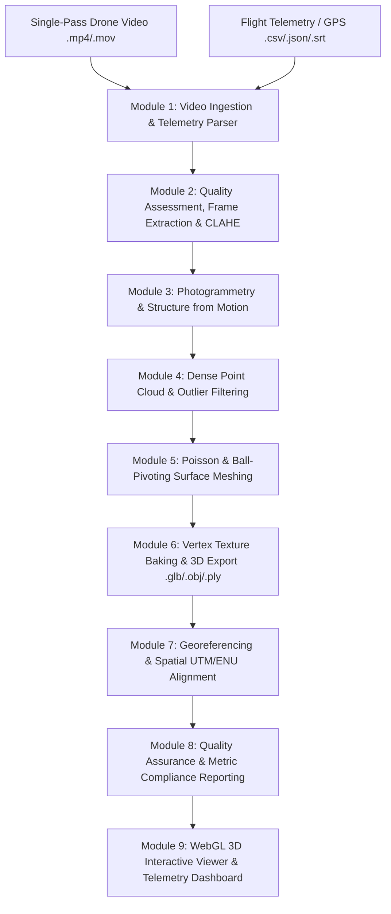

# SYSTEM MODULE DESIGN (SMD)
## ElevateX — AI-Enabled Single-Pass Drone Video to Georeferenced 3D Model Generation System

**Project Title:** ElevateX Photogrammetry & Geospatial Reconstruction System  
**Smart India Hackathon (SIH) Problem Statement:** `SIH26158 – Single-Pass Drone Video to Accurate 3D Model Generation System`  
**Theme:** Robotics and Drones / Geospatial AI  
**Document Type:** System Module Design (SMD) & Software Architecture Specification  
**Version:** 1.0.0  

---

## 1. Executive Summary & Problem Formulation

### 1.1 Objective
Reconstruct metric-accurate, watertight, dense 3D terrain and structural models (buildings, roads, topography, vegetation) from **a single continuous UAV flight video** accompanied by optional asynchronous GPS / IMU telemetry metadata.

### 1.2 Key Engineering Challenges Addressed
1. **Single-Pass Redundancy & Motion Blur:** Conventional photogrammetry requires multi-grid crosshatch flights with 75-80% overlap. ElevateX handles sequential single-pass video by extracting motion-adaptive keyframes with Laplacian blur filtering and SSIM deduplication.
2. **Illumination Variations & Shadows:** Dynamically enhances feature contrast across uneven lighting using CLAHE (Contrast Limited Adaptive Histogram Equalization).
3. **Dual-Engine Photogrammetry Pipeline:** Seamlessly leverages hardware-accelerated **COLMAP (SfM + MVS)** when present, with automatic zero-configuration fallback to an integrated **OpenCV + Open3D SfM & Dense Disparity Engine**.
4. **WGS84 Georeferencing & Metric Scale:** Resolves scale ambiguity by projecting drone GPS/telemetry to Universal Transverse Mercator (UTM) coordinates and computing a 4x4 Euclidean transformation matrix into local East-North-Up (ENU) coordinates.

---

## 2. High-Level System Architecture



---

## 3. Detailed Module Specifications

### Module 1: Ingestion & Telemetry Processing
- **Source Files:** `pipeline/video_processing.py`, `services/metadata_service.py`, `services/gps_service.py`
- **Responsibilities:**
  - Ingests raw video container files (`.mp4`, `.mov`, `.avi`, `.mkv`).
  - Extracts container metadata (codec, total frames, framerate, duration, resolution).
  - Detects and parses asynchronous flight logs (DJI SRT subtitles, CSV flight logs, JSON GPS sequences, EXIF tags).
  - Normalizes temporal timestamps between video frames and GPS telemetry.

### Module 2: Intelligent Keyframe Extraction & Image Preprocessing
- **Source Files:** `pipeline/frame_extraction.py`, `pipeline/frame_quality.py`, `pipeline/image_preprocessing.py`
- **Key Algorithms:**
  - **Motion-Adaptive Candidate Pool:** Samples 4 fps candidates across the trajectory (up to 700 frames).
  - **Laplacian Variance Blur Scoring:**
    $$\text{Blur Score} = \text{Var}(\nabla^2 I) = \frac{1}{N} \sum (L(x, y) - \bar{L})^2$$
    Rejects frames below threshold ($\tau_{\text{blur}} = 40.0$).
  - **Luminance Exposure Filtering:** Rejects underexposed (<30) and blown-out overexposed (>240) frames.
  - **SSIM & Histogram Deduplication:** Compares adjacent frames to eliminate stationary hovering duplicates (SSIM > 0.985, Hist Corr > 0.995).
  - **CLAHE Illumination Equalization:** Applies local contrast equalization in LAB color space (Clip Limit = 2.0, Grid Size = 8x8).
  - **Dynamic Masking & Sky Suppression:** Soft-suppresses feature matching on sky regions (upper 25% zone) and dynamic moving objects.

### Module 3: 3D Structure from Motion (SfM)
- **Source Files:** `pipeline/colmap_pipeline.py`, `pipeline/reconstruction.py`
- **Primary Engine (COLMAP CLI):**
  - **Feature Extraction:** SIFT multi-scale descriptor extraction (up to 8,192 keypoints per image) with shared single-camera intrinsics (`OPENCV` radial-tangential distortion model).
  - **Sequential Matching:** Matches each frame against $\pm 25$ neighborhood frames with quadratic orbital overlap.
  - **Incremental Mapping & Bundle Adjustment:** Triangulates 3D tie points and optimizes camera poses $(R_i, t_i)$ and 3D points $X_j$ by minimizing reprojection error:
    $$\min_{R_i, t_i, X_j} \sum_{i,j} \left\| x_{ij} - \pi(K, R_i, t_i, X_j) \right\|^2$$
- **Native Fallback Engine (OpenCV Pure SfM):**
  - SIFT/ORB feature matching with FLANN KD-Tree and Lowe's Ratio Test ($0.75$).
  - 5-point Essential Matrix estimation with RANSAC ($E = [t]_\times R$).
  - Cheirality-verified pose recovery and linear triangulation with optical flow disparity depth map synthesis.

### Module 4: Point Cloud Optimization & Outlier Cleaning
- **Source Files:** `pipeline/mesh_generation.py`, `pipeline/reconstruction.py`
- **Key Algorithms:**
  - **Statistical Outlier Removal (SOR):** Computes mean distance to $k=20$ nearest neighbors; strips points with distance $> \mu + 2.5\sigma$.
  - **Radius Outlier Removal (ROR):** Ensures each valid point has at least 6 neighbor points within search sphere $r = 3.0 \times \bar{d}_{\text{NN}}$.
  - **Normal Vector Estimation & Orientation:** Estimates surface normals using PCA covariance over $k$-neighborhoods and orients normals toward camera trajectory centers.

### Module 5: 3D Surface Mesh Reconstruction
- **Source Files:** `pipeline/mesh_generation.py`
- **Key Algorithms:**
  - **Screened Poisson Surface Reconstruction:** Fits an implicit indicator function $\chi$ whose gradient matches the oriented normal vector field $\vec{V}$:
    $$\nabla^2 \chi = \nabla \cdot \vec{V} \quad \text{at Octree Depth } d=9$$
  - **Ball-Pivoting Algorithm (BPA) Fallback:** Rolls virtual spheres of increasing radii $(0.02, 0.04, 0.08)$ across point cloud triplets to form triangular facets.
  - **Mesh Cleaning:** Removes degenerate zero-area faces, unreferenced vertices, and low-density boundary artifacts.

### Module 6: Texture Baking & Multi-Format Exporter
- **Source Files:** `pipeline/texture_generation.py`
- **Responsibilities:**
  - Bakes true RGB color data into mesh vertex attributes via KD-Tree nearest neighbor projection.
  - Generates cross-platform 3D formats:
    - `model.glb` (Binary glTF 2.0 with embedded buffers for Three.js WebGL).
    - `model.ply` (Point cloud and polygon file with vertex colors).
    - `model.obj` + `model.mtl` (Standard wavefront format for CAD/GIS).

### Module 7: Georeferencing & Coordinate Transformation
- **Source Files:** `services/gps_service.py`, `pipeline/georeferencing.py`
- **Coordinate Systems:**
  1. **WGS84 Geodetic:** $(\text{Latitude } \phi, \text{Longitude } \lambda, \text{Altitude } h)$.
  2. **Universal Transverse Mercator (UTM):** Projects ellipsoidal coordinates into planar Easting $(E)$, Northing $(N)$, Elevation $(Z)$ in meters.
  3. **Local East-North-Up (ENU) Frame:** Translates origin $(0, 0, 0)$ to the first GPS anchor point.
  - Computes 7-DOF Helmert similarity transformation (Scale $s$, Rotation $R$, Translation $T$):
    $$\mathbf{X}_{\text{UTM}} = s \cdot R \cdot \mathbf{X}_{\text{local}} + T$$

### Module 8: Quality Assurance & Metric Compliance
- **Source Files:** `pipeline/quality_assessment.py`
- **Key Metrics Generated:**
  - **Ground Sample Distance (GSD):** Spatial resolution in cm/pixel.
  - **Camera Registration Rate:** Percentage of video frames successfully solved in SfM ($> 60\%$).
  - **Mean Reprojection Error:** Pixel reprojection accuracy ($< 1.5$ px).
  - **Bounding Box & Surface Density:** Spatial dimensions (X, Y, Z meters), triangle count, and point density ($pts/m^2$).
  - Outputs structured audit files: `quality_report.json` and `georeference_report.json`.

### Module 9: WebGL Interactive 3D Viewer & REST API Server
- **Source Files:** `app.py`, `services/processing_service.py`, `web/static/js/viewer.js`, `web/templates/index.html`
- **Features:**
  - Real-time drag-and-drop file upload with asynchronous background processing.
  - Three.js WebGL Canvas with OrbitControls, directional lighting, and shadows.
  - Render mode toggles: **Solid Textured Mesh**, **Wireframe**, and **Point Cloud**.
  - **Interactive 3D Measurement Ruler:** Raycasting tool computing Euclidean 3D distances between picked vertices in real-world metric units.
  - Sensor & Telemetry status indicators (GPS, IMU, RTK, Focal Length Prior).

---

## 4. REST API Interface Specification

| HTTP Method | Endpoint | Description | Request Payload | Response |
|---|---|---|---|---|
| `GET` | `/api/system/status` | Queries COLMAP availability & environment | None | `{"status":"ONLINE","colmap_available":true}` |
| `POST` | `/api/upload` | Uploads video and telemetry files | `multipart/form-data` | `{"video_path":"...","telemetry_path":"..."}` |
| `POST` | `/api/process/start` | Initiates 7-stage reconstruction | `{"video_path":"...","telemetry_path":"..."}` | `{"success":true,"message":"Started"}` |
| `GET` | `/api/process/status` | Polls current stage & progress % | None | `{"state":"RUNNING","progress":65,"stage":"Stage 4"}` |
| `GET` | `/api/models/<filename>` | Streams `.glb`, `.ply`, `.obj` 3D files | URL parameter | Binary stream (`model/gltf-binary`) |
| `GET` | `/api/reports/<filename>`| Serves JSON quality reports | URL parameter | `application/json` |

---

## 5. Technology Stack Summary

- **Backend Framework:** Python 3.11+, Flask 3.1+
- **Computer Vision & SfM:** OpenCV 4.10+, COLMAP 3.9+ (CLI integration)
- **3D Geometry & Meshing:** Open3D 0.19+, Trimesh 4.6+, NumPy, SciPy, Pandas
- **Frontend & Visualization:** Three.js (WebGL, OrbitControls, GLTFLoader, PLYLoader), Modern CSS3 Glassmorphism
- **Geodesy & Spatial Math:** Custom WGS84-to-UTM / ENU projection math engine

---

## 6. Execution & Verification Guide

### Web Dashboard Mode
```bash
python app.py
# Access http://127.0.0.1:5000 in your browser
```

### CLI Headless / Full Pipeline Mode
```bash
python run_all.py
# If no video is present in data/input/videos, run_all.py automatically creates a synthetic 3D orbital flight demo for verification
```
